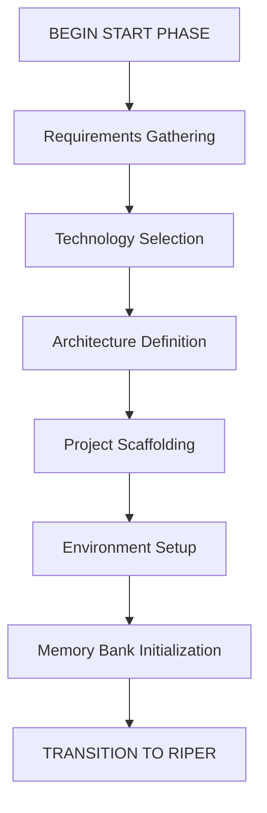

# Cursor IDE: Enhanced AI Assistant Framework

A robust and advanced rule set framework integrates three powerful AI-assisted coding strategies within the Cursor IDE. This comprehensive system is specifically crafted to temper Claude 3.7's over-enthusiasm, ensuring it stays on track and avoids veering off course.

1. **START PHASE**
 The START phase is a preprocessing phase that runs once at the beginning of a new project or major component. It focuses on project initialization, scaffolding, and setting up the Memory Bank with baseline information. [start-phase-readme.md](./start-phase-readme.md)

2.  **RIPER-5 Mode System**: A structured workflow with five distinct operational modes (Research, Innovate, Plan, Execute, Review) to ensure precise, controlled development.

      Ripper Framework:
       by [robotlovehuman](https://forum.cursor.com/u/robotlovehuman/summary), [github](https://github.com/robotlovehuman)

      [Original post on the Cursor Forum](https://forum.cursor.com/t/i-created-an-amazing-mode-called-riper-5-mode-fixes-claude-3-7-drastically/65516)

3. **Memory Bank**: A persistent documentation system that maintains project context between sessions through hierarchical memory files.

   Memory bank sources: 

   [file-cursor-memory-bank-rules-md](https://gist.github.com/ipenywis/1bdb541c3a612dbac4a14e1e3f4341ab#file-cursor-memory-bank-rules-md)

   [.cursorrules](https://github.com/kownacki/ai-assistant/blob/main/.cursorrules)
   
4. **Context Management**: A dynamic system for tracking relevance-scored information, personal preferences, and implementation plans.

## Key Features

- **Strict Operational Protocol**: Clear mode declarations prevent unintended modifications
- **Persistent Context**: Never lose important project information between sessions
- **Structured Documentation**: Standardized templates for all memory files
- **Implementation Planning**: Thorough planning with clarifying questions and checklists
- **Automatic Updates**: Memory files stay current through continuous documentation
- **Project Intelligence**: Learning from patterns and preferences over time

## Getting Started

1. Copy this repository into your Cursor IDE project
2. Add the files to the Cursor rules within your project
3. Initialize the Start phase and memory bank using the provided templates (in the chat window /start)
4. Begin with RESEARCH mode to understand your codebase
5. Progress through INNOVATE and PLAN modes before implementation
6. Track progress and maintain documentation as you work

## Documentation

See the full [cursor_enhanced_rule_set.md](./cursor_enhanced_rule_set.md) file for complete documentation using this framework.

You can rename the .cursorrules file and include it in your project, or add the individual files to the project's ruleset.

---

*This framework prevents coding disasters while maintaining perfect continuity across sessions.*
*Works without MCP Servers*
*Works better with MCP Servers*
