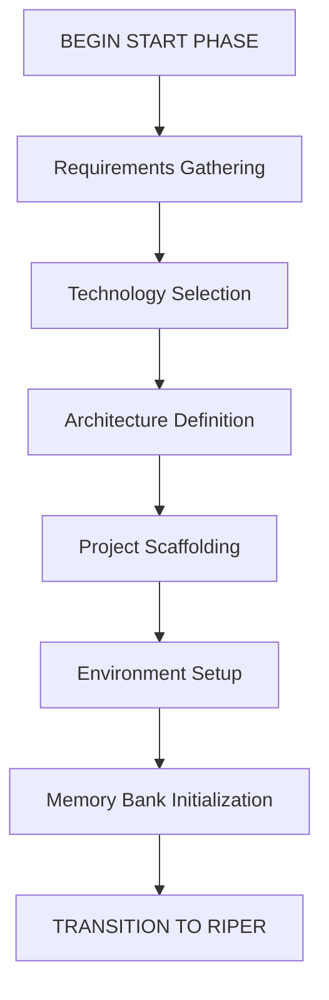
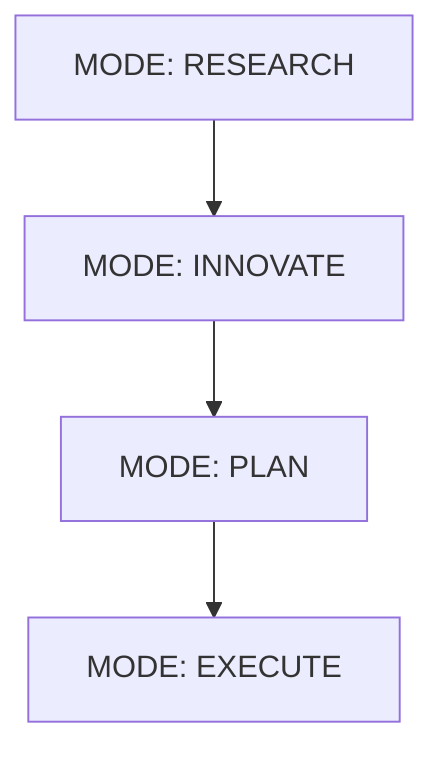

# Cursor IDE: Enhanced AI Assistant Framework

A comprehensive, advanced rule set framework combines three powerful AI-assisted coding approaches in Cursor IDE. It is designed to tame Claude 3.7's eagerness and not drive off the road.:

1. **START PHASE**
 The START phase is a preprocessing phase that runs once at the beginning of a new project or major component. It focuses on project initialization, scaffolding, and setting up the Memory Bank with baseline information. [start-phase-readme.md](./start-phase-readme.md)

2.  **RIPER-5 Mode System**: A structured workflow with five distinct operational modes (Research, Innovate, Plan, Execute, Review) to ensure precise, controlled development.

      Ripper Framework:
       by [robotlovehuman](https://forum.cursor.com/u/robotlovehuman/summary)

      [Original post on the Cursor Forum](https://forum.cursor.com/t/i-created-an-amazing-mode-called-riper-5-mode-fixes-claude-3-7-drastically/65516)

3. **Memory Bank**: A persistent documentation system that maintains project context between sessions through hierarchical memory files.

   Memory bank sources: 

   [file-cursor-memory-bank-rules-md](https://gist.github.com/ipenywis/1bdb541c3a612dbac4a14e1e3f4341ab#file-cursor-memory-bank-rules-md)

   [.cursorrules](https://github.com/kownacki/ai-assistant/blob/main/.cursorrules)
   
4. **Context Management**: A dynamic system for tracking relevance-scored information, personal preferences, and implementation plans.

## Key Features

- **Strict Operational Protocol**: Clear mode declarations prevent unintended modifications
- **Persistent Context**: Never lose important project information between sessions
- **Structured Documentation**: Standardized templates for all memory files
- **Implementation Planning**: Thorough planning with clarifying questions and checklists
- **Automatic Updates**: Memory files stay current through continuous documentation
- **Project Intelligence**: Learning from patterns and preferences over time

## Getting Started

1. Clone this repository into your Cursor IDE project
2. Initialize the memory bank using the provided templates
3. Begin with RESEARCH mode to understand your codebase
4. Progress through INNOVATE and PLAN modes before implementation
5. Track progress and maintain documentation as you work

## Documentation

See the full [cursor_enhanced_rule_set.md](./cursor_enhanced_rule_set.md) file for complete documentation using this framework.

You can rename the file .cursorrules and add it to your project.

---

*This framework prevents coding disasters while maintaining perfect continuity across sessions.*
