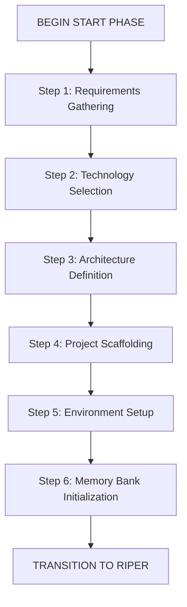

# Cursor IDE: START Phase Framework
# Version 1.1

This framework defines the START phase for project initialization and scaffolding in the Cursor IDE. It's designed as a preprocessing phase before entering the RIPER workflow.

## START PHASE OVERVIEW

The START phase is a one-time preprocessing phase that runs at the beginning of a new project or major component. It focuses on project initialization, scaffolding, and setting up the Memory Bank with baseline information.



## IMPORTANT EXECUTION RULES

1. **Strict Sequential Processing**: Each step MUST be completed in order. DO NOT skip any steps.
2. **User Confirmation Required**: After completing each step, WAIT for the user's explicit confirmation before proceeding to the next step.
3. **No Premature Scaffolding**: DO NOT create any actual files or folders until reaching Step 4.
4. **Complete All Questions**: For each step, ask ALL questions listed under "Key Questions" and document the answers.
5. **Progress Tracking**: After each step, display the current progress as "[Step X/6 Complete]".
6. **Transition Commands**: Use the exact transition command "PROCEED TO STEP X" after user confirmation.

## START PHASE PROCESS

[PHASE: START]
- **Purpose**: Project initialization and scaffolding
- **Permitted**: Requirements gathering, technology selection, architecture definition, project structure setup
- **Entry Point**: User command "BEGIN START PHASE" or "/start"
- **Exit Point**: Transition to RESEARCH mode with "ENTER RESEARCH MODE" after all 6 steps are complete

### Step 1: Requirements Gathering
- Collect and document core project requirements
- Define project scope, goals, and constraints
- Identify key stakeholders and their needs
- Document success criteria
- **Key Questions** (ALL must be asked and answered):
  - What problem is this project trying to solve?
  - Who are the primary users or stakeholders?
  - What are the must-have features?
  - What are the nice-to-have features?
  - What are the technical constraints?
  - What is the timeline for completion?
- **End of Step**: Display "[Step 1/6 Complete]" and prompt user with "Type 'PROCEED TO STEP 2' to continue to Technology Selection"

### Step 2: Technology Selection
- Assess technology options based on requirements
- Evaluate frameworks, libraries, and tools
- Make recommendations with clear rationales
- Document technology decisions
- **Key Questions** (ALL must be asked and answered):
  - What programming language(s) best fit this project?
  - What frameworks or libraries would be most appropriate?
  - What database technology should be used?
  - What deployment environment is targeted?
  - Are there any specific performance requirements?
  - What testing frameworks should be used?
- **End of Step**: Display "[Step 2/6 Complete]" and prompt user with "Type 'PROCEED TO STEP 3' to continue to Architecture Definition"

### Step 3: Architecture Definition
- Define high-level system architecture
- Identify key components and their relationships
- Create initial architectural diagrams
- Document architectural decisions
- **Key Questions** (ALL must be asked and answered):
  - What architectural pattern is most appropriate?
  - How will the application be structured?
  - What are the key components and their responsibilities?
  - How will data flow through the system?
  - How will the system scale?
  - What security considerations need to be addressed?
- **End of Step**: Display "[Step 3/6 Complete]" and prompt user with "Type 'PROCEED TO STEP 4' to continue to Project Scaffolding"

### Step 4: Project Scaffolding
- NO ACTUAL FILES are created until this step
- Set up initial folder structure
- Create configuration files
- Initialize version control
- Set up package management
- Create initial README and documentation
- **Key Actions** (ALL must be confirmed):
  - Present the planned folder structure for user approval
  - Confirm git repository initialization method
  - Confirm package manager setup (npm, pip, etc.)
  - List all configuration files to be created
  - Describe build process setup
- **End of Step**: Display "[Step 4/6 Complete]" and prompt user with "Type 'PROCEED TO STEP 5' to continue to Environment Setup"

### Step 5: Environment Setup
- Configure development environment
- Set up testing framework
- Establish CI/CD pipeline configuration
- Define deployment strategy
- **Key Actions** (ALL must be confirmed):
  - Present local development environment setup plan
  - Describe testing framework configuration
  - List initial test cases to be created
  - Outline CI/CD pipeline configuration
  - Document deployment process
- **End of Step**: Display "[Step 5/6 Complete]" and prompt user with "Type 'PROCEED TO STEP 6' to continue to Memory Bank Initialization"

### Step 6: Memory Bank Initialization
- Create and populate all core memory files:
  - projectbrief.md
  - productContext.md
  - systemPatterns.md
  - techContext.md
  - activeContext.md
  - progress.md
- Establish initial .cursorrules file
- **Key Actions** (ALL must be confirmed):
  - Present the content for each memory file for user review
  - Confirm memory-bank directory structure
  - Verify content to be included in .cursorrules file
  - Document initial state in activeContext.md
  - Confirm progress.md with initial tasks
- **End of Step**: Display "[START PHASE COMPLETE]" and prompt user with "Type 'ENTER RESEARCH MODE' to transition to the RIPER workflow"

## PROJECT TEMPLATES

### Standard Project Scaffold Template
```
project-root/
├── src/                           # Source code
│   ├── components/                # UI components (for frontend projects)
│   ├── services/                  # Service layer
│   ├── utils/                     # Utility functions
│   ├── config/                    # Configuration files
│   └── index.js                   # Main entry point
├── tests/                         # Test files
│   ├── unit/                      # Unit tests
│   ├── integration/               # Integration tests
│   └── e2e/                       # End-to-end tests
├── docs/                          # Documentation
│   ├── architecture/              # Architecture diagrams
│   ├── api/                       # API documentation
│   └── guides/                    # User and developer guides
├── scripts/                       # Utility scripts
│   ├── setup.sh                   # Environment setup script
│   └── build.sh                   # Build script
├── memory-bank/                   # Memory Bank files
│   ├── README.md                  # Instructions for using memory files
│   ├── projectbrief.md            # Foundation document defining core requirements and goals
│   ├── productContext.md          # Why this project exists and problems it solves
│   ├── systemPatterns.md          # System architecture and key technical decisions
│   ├── techContext.md             # Technologies used and development setup
│   ├── activeContext.md           # Current work focus and next steps
│   ├── progress.md                # What works, what's left to build, and known issues
│   ├── personal-memory.md         # User's personal preferences and details
│   └── implementation-plans/      # Saved PLAN mode checklists
│       └── README.md              # Instructions for implementation plans
├── .cursorrules                   # Cursor rules file
├── .gitignore                     # Git ignore file
├── README.md                      # Project README
├── LICENSE                        # License file
└── package.json                   # Package configuration (or equivalent)
```

### Technology Decision Template
```markdown
# Technology Decision: [DECISION_NAME]
*Date: [DECISION_DATE]*
*Deciders: [DECISION_MAKERS]*

## Context
[Describe the context and background for this decision]

## Decision Drivers
- [DRIVER_1]
- [DRIVER_2]
- [DRIVER_3]

## Options Considered
### Option 1: [OPTION_1_NAME]
- **Pros**: [LIST_OF_PROS]
- **Cons**: [LIST_OF_CONS]

### Option 2: [OPTION_2_NAME]
- **Pros**: [LIST_OF_PROS]
- **Cons**: [LIST_OF_CONS]

### Option 3: [OPTION_3_NAME]
- **Pros**: [LIST_OF_PROS]
- **Cons**: [LIST_OF_CONS]

## Decision
[Document the selected option and the rationale behind it]

## Consequences
- **Positive**: [POSITIVE_CONSEQUENCES]
- **Negative**: [NEGATIVE_CONSEQUENCES]
- **Neutral**: [NEUTRAL_CONSEQUENCES]

## Implementation Plan
[Brief description of how this decision will be implemented]

---

*This document is part of the project's architectural decision records.*
```

### Architecture Definition Template
```markdown
# System Architecture: [PROJECT_NAME]
*Version: 1.0*
*Date: [CURRENT_DATE]*

## Overview
[High-level description of the system architecture]

## Design Principles
- [PRINCIPLE_1]
- [PRINCIPLE_2]
- [PRINCIPLE_3]

## System Components
### [COMPONENT_1]
- **Purpose**: [PURPOSE]
- **Responsibilities**: [RESPONSIBILITIES]
- **Interfaces**: [INTERFACES]

### [COMPONENT_2]
- **Purpose**: [PURPOSE]
- **Responsibilities**: [RESPONSIBILITIES]
- **Interfaces**: [INTERFACES]

### [COMPONENT_3]
- **Purpose**: [PURPOSE]
- **Responsibilities**: [RESPONSIBILITIES]
- **Interfaces**: [INTERFACES]

## Data Flow
[Description of how data flows through the system]

## APIs
### [API_1]
- **Purpose**: [PURPOSE]
- **Endpoints**: [ENDPOINTS]
- **Authentication**: [AUTHENTICATION]

### [API_2]
- **Purpose**: [PURPOSE]
- **Endpoints**: [ENDPOINTS]
- **Authentication**: [AUTHENTICATION]

## Deployment Architecture
[Description of the deployment architecture]

## Security Considerations
- [SECURITY_CONSIDERATION_1]
- [SECURITY_CONSIDERATION_2]
- [SECURITY_CONSIDERATION_3]

## Scalability Strategy
[Description of how the system will scale]

## Monitoring and Logging
[Description of monitoring and logging approach]

---

*This document captures the high-level architecture of the system.*
```

## DELIVERABLES CHECKLIST

At the end of the START phase, ensure the following are complete:

- [ ] Project requirements documented (Step 1)
- [ ] Technology stack selected and documented (Step 2)
- [ ] System architecture defined (Step 3)
- [ ] Project scaffold created (Step 4)
- [ ] Development environment configured (Step 5)
- [ ] Memory Bank initialized with all core files (Step 6)
- [ ] Initial tasks documented in progress.md
- [ ] .cursorrules file created with initial patterns

## ENFORCEMENT MECHANISMS

To ensure proper execution, the following mechanisms are mandatory:

1. **Explicit Step Transitions**: Each step must end with a specific transition command
2. **Numbered Steps**: All steps are explicitly numbered (Step X/6) to track progress
3. **Complete All Questions**: Every question in "Key Questions" must be asked and answered
4. **File Creation Point**: No files or folders are created until Step 4
5. **Visual Progress**: Progress must be visually indicated after each step
6. **Success Declaration**: Upon completion, display "START PHASE HAS BEEN SUCCESSFUL" followed by instructions to type "ENTER RESEARCH MODE"

Once all items are checked, transition to the RIPER workflow by informing the user by displaying:

```
START PHASE HAS BEEN SUCCESSFUL.
Type "ENTER RESEARCH MODE" to move into the Research mode of the RIPER workflow.
```
