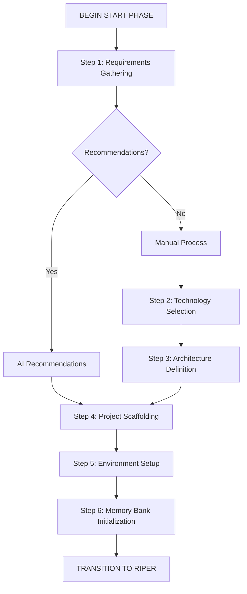

# Cursor IDE: START Phase Framework
# Version 1.2

This framework defines the START phase for project initialization and scaffolding in the Cursor IDE. It's designed as a preprocessing phase before entering the RIPER workflow.

## START PHASE OVERVIEW

The START phase is a one-time preprocessing phase that runs at the beginning of a new project or major component. It focuses on project initialization, scaffolding, and setting up the Memory Bank with baseline information.



## IMPORTANT EXECUTION INSTRUCTIONS

1. **Strict Sequential Processing**: Each step MUST be completed in order. DO NOT skip any steps.
2. **User Confirmation Required**: After completing each step, WAIT for the user's explicit confirmation before proceeding.
3. **File Creation Instructions**: When reaching Step 4, ACTIVELY CREATE the defined folders and files.
4. **AI Recommendations Option**: After Step 1, offer the user an option to receive AI recommendations for technology and architecture.
5. **Progress Tracking**: After each step, display the current progress as "[Step X/6 Complete]".
6. **Transition Commands**: Use the exact transition command "PROCEED TO STEP X" after user confirmation.

## START PHASE PROCESS

[PHASE: START]
- **Purpose**: Project initialization and scaffolding
- **Permitted**: Requirements gathering, technology selection, architecture definition, project structure setup
- **Entry Point**: User command "BEGIN START PHASE" or "/start"
- **Exit Point**: Transition to RESEARCH mode with "ENTER RESEARCH MODE" after all steps are complete

### Step 1: Requirements Gathering
- Collect and document core project requirements
- Define project scope, goals, and constraints
- Identify key stakeholders and their needs
- Document success criteria
- **Key Questions** (ALL must be asked and answered):
  - What problem is this project trying to solve?
  - Who are the primary users or stakeholders?
  - What are the must-have features?
  - What are the nice-to-have features?
  - What are the technical constraints?
  - What is the timeline for completion?
- **End of Step**: Display "[Step 1/6 Complete]" and provide user with two options:
  1. Type "AI RECOMMEND" to have AI provide intelligent recommendations for technology and architecture (skips to Step 4)
  2. Type "PROCEED TO STEP 2" to manually continue through technology selection

### AI Recommendation Option
- If user chooses "AI RECOMMEND":
  - Analyze requirements gathered in Step 1
  - Generate intelligent recommendations for:
    - Programming languages and frameworks
    - Database technologies
    - Architecture patterns
    - Project structure
  - Present comprehensive recommendations to user
  - Ask for user confirmation: "Are these recommendations acceptable? Type 'ACCEPT RECOMMENDATIONS' to proceed to Step 4"
  - Upon acceptance, document decisions in the memory bank and PROCEED TO STEP 4

### Step 2: Technology Selection
- Assess technology options based on requirements
- Evaluate frameworks, libraries, and tools
- Make recommendations with clear rationales
- Document technology decisions
- **Key Questions** (ALL must be asked and answered):
  - What programming language(s) best fit this project?
  - What frameworks or libraries would be most appropriate?
  - What database technology should be used?
  - What deployment environment is targeted?
  - Are there any specific performance requirements?
  - What testing frameworks should be used?
- **End of Step**: Display "[Step 2/6 Complete]" and prompt user with "Type 'PROCEED TO STEP 3' to continue to Architecture Definition"

### Step 3: Architecture Definition
- Define high-level system architecture
- Identify key components and their relationships
- Create initial architectural diagrams
- Document architectural decisions
- **Key Questions** (ALL must be asked and answered):
  - What architectural pattern is most appropriate?
  - How will the application be structured?
  - What are the key components and their responsibilities?
  - How will data flow through the system?
  - How will the system scale?
  - What security considerations need to be addressed?
- **End of Step**: Display "[Step 3/6 Complete]" and prompt user with "Type 'PROCEED TO STEP 4' to continue to Project Scaffolding"

### Step 4: Project Scaffolding
- SET UP INITIAL FOLDER STRUCTURE AND CREATE FILES NOW
- **Actions to Execute** (these are not suggestions but commands to be executed):
  - Create project root directory
  - Generate all subdirectories following the defined structure
  - Create initial configuration files
  - Initialize git repository (if specified)
  - Set up package management
  - CREATE initial README and documentation files
- **Files to Create**:
  - Directory structure exactly as specified in the template
  - Configuration files (.gitignore, package.json, etc.)
  - README.md with project information
  - License file if specified
- **End of Step**: Display "[Step 4/6 Complete]" and prompt user with "Type 'PROCEED TO STEP 5' to continue to Environment Setup"

### Step 5: Environment Setup
- Configure development environment
- Set up testing framework
- Establish CI/CD pipeline configuration
- Define deployment strategy
- **Actions to Execute**:
  - CREATE all environment configuration files
  - GENERATE initial test files
  - CREATE CI/CD configuration files
  - DOCUMENT deployment process in appropriate files
- **End of Step**: Display "[Step 5/6 Complete]" and prompt user with "Type 'PROCEED TO STEP 6' to continue to Memory Bank Initialization"

### Step 6: Memory Bank Initialization
- **Actions to Execute**:
  - CREATE memory-bank directory if not already created
  - GENERATE all core memory files with content:
    - projectbrief.md
    - productContext.md
    - systemPatterns.md
    - techContext.md
    - activeContext.md
    - progress.md
  - ESTABLISH initial .cursorrules file
- **End of Step**: Display "[START PHASE COMPLETE]" and prompt user with "Type 'ENTER RESEARCH MODE' to transition to the RIPER workflow"

## PROJECT TEMPLATES

### Standard Project Scaffold Template
```
project-root/
├── src/                           # Source code
│   ├── components/                # UI components (for frontend projects)
│   ├── services/                  # Service layer
│   ├── utils/                     # Utility functions
│   ├── config/                    # Configuration files
│   └── index.js                   # Main entry point
├── tests/                         # Test files
│   ├── unit/                      # Unit tests
│   ├── integration/               # Integration tests
│   └── e2e/                       # End-to-end tests
├── docs/                          # Documentation
│   ├── architecture/              # Architecture diagrams
│   ├── api/                       # API documentation
│   └── guides/                    # User and developer guides
├── scripts/                       # Utility scripts
│   ├── setup.sh                   # Environment setup script
│   └── build.sh                   # Build script
├── memory-bank/                   # Memory Bank files
│   ├── README.md                  # Instructions for using memory files
│   ├── projectbrief.md            # Foundation document defining core requirements and goals
│   ├── productContext.md          # Why this project exists and problems it solves
│   ├── systemPatterns.md          # System architecture and key technical decisions
│   ├── techContext.md             # Technologies used and development setup
│   ├── activeContext.md           # Current work focus and next steps
│   ├── progress.md                # What works, what's left to build, and known issues
│   ├── personal-memory.md         # User's personal preferences and details
│   └── implementation-plans/      # Saved PLAN mode checklists
│       └── README.md              # Instructions for implementation plans
├── .cursorrules                   # Cursor rules file
├── .gitignore                     # Git ignore file
├── README.md                      # Project README
├── LICENSE                        # License file
└── package.json                   # Package configuration (or equivalent)
```

### Technology Decision Template
```markdown
# Technology Decision: [DECISION_NAME]
*Date: [DECISION_DATE]*
*Deciders: [DECISION_MAKERS]*

## Context
[Describe the context and background for this decision]

## Decision Drivers
- [DRIVER_1]
- [DRIVER_2]
- [DRIVER_3]

## Options Considered
### Option 1: [OPTION_1_NAME]
- **Pros**: [LIST_OF_PROS]
- **Cons**: [LIST_OF_CONS]

### Option 2: [OPTION_2_NAME]
- **Pros**: [LIST_OF_PROS]
- **Cons**: [LIST_OF_CONS]

### Option 3: [OPTION_3_NAME]
- **Pros**: [LIST_OF_PROS]
- **Cons**: [LIST_OF_CONS]

## Decision
[Document the selected option and the rationale behind it]

## Consequences
- **Positive**: [POSITIVE_CONSEQUENCES]
- **Negative**: [NEGATIVE_CONSEQUENCES]
- **Neutral**: [NEUTRAL_CONSEQUENCES]

## Implementation Plan
[Brief description of how this decision will be implemented]

---

*This document is part of the project's architectural decision records.*
```

### Architecture Definition Template
```markdown
# System Architecture: [PROJECT_NAME]
*Version: 1.0*
*Date: [CURRENT_DATE]*

## Overview
[High-level description of the system architecture]

## Design Principles
- [PRINCIPLE_1]
- [PRINCIPLE_2]
- [PRINCIPLE_3]

## System Components
### [COMPONENT_1]
- **Purpose**: [PURPOSE]
- **Responsibilities**: [RESPONSIBILITIES]
- **Interfaces**: [INTERFACES]

### [COMPONENT_2]
- **Purpose**: [PURPOSE]
- **Responsibilities**: [RESPONSIBILITIES]
- **Interfaces**: [INTERFACES]

### [COMPONENT_3]
- **Purpose**: [PURPOSE]
- **Responsibilities**: [RESPONSIBILITIES]
- **Interfaces**: [INTERFACES]

## Data Flow
[Description of how data flows through the system]

## APIs
### [API_1]
- **Purpose**: [PURPOSE]
- **Endpoints**: [ENDPOINTS]
- **Authentication**: [AUTHENTICATION]

### [API_2]
- **Purpose**: [PURPOSE]
- **Endpoints**: [ENDPOINTS]
- **Authentication**: [AUTHENTICATION]

## Deployment Architecture
[Description of the deployment architecture]

## Security Considerations
- [SECURITY_CONSIDERATION_1]
- [SECURITY_CONSIDERATION_2]
- [SECURITY_CONSIDERATION_3]

## Scalability Strategy
[Description of how the system will scale]

## Monitoring and Logging
[Description of monitoring and logging approach]

---

*This document captures the high-level architecture of the system.*
```

## DELIVERABLES CHECKLIST

At the end of the START phase, ensure the following are complete:

- [ ] Project requirements documented (Step 1)
- [ ] Technology stack selected and documented (Step 2 or AI Recommendations)
- [ ] System architecture defined (Step 3 or AI Recommendations)
- [ ] Project scaffold created (Step 4)
- [ ] Development environment configured (Step 5)
- [ ] Memory Bank initialized with all core files (Step 6)
- [ ] Initial tasks documented in progress.md
- [ ] .cursorrules file created with initial patterns

## EXECUTION COMMANDS

The following explicit commands must be executed:

1. **At Step 4**: CREATE ALL FOLDERS AND FILES according to the template structure.
2. **At Step 5**: CREATE ENVIRONMENT FILES AND TEST FILES.
3. **At Step 6**: CREATE MEMORY BANK FILES with detailed content based on previous steps.

## SUCCESS NOTIFICATION

Once all items are checked, transition to the RIPER workflow by displaying:

```
START PHASE HAS BEEN SUCCESSFUL.
Type "ENTER RESEARCH MODE" to move into the Research mode of the RIPER workflow.
```
