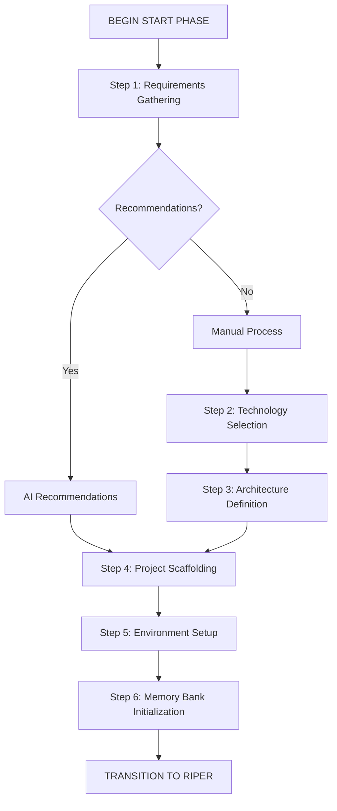

# Cursor IDE: START Phase Framework

A structured approach to project initialization for AI-assisted development in Cursor IDE, with sequential step enforcement and AI recommendation capabilities.

## Overview

The START Phase provides a systematic process for initializing new projects or major components before entering the RIPER workflow. It focuses on establishing a solid foundation through requirements gathering, technology selection, architecture definition, and memory bank setup with explicit step transitions and file creation points.

## Key Features

- **Requirements Gathering**: Structured approach to collecting project requirements
- **AI Recommendations**: Option to receive intelligent AI recommendations for technology and architecture
- **Technology Selection**: Framework for evaluating and selecting appropriate technologies
- **Architecture Definition**: Process for designing high-level system architecture
- **Project Scaffolding**: Templates for establishing consistent project structure with explicit file creation
- **Environment Setup**: Guidelines for configuring development environments
- **Memory Bank Initialization**: Process for setting up the memory bank with baseline information
- **Sequential Process Enforcement**: Clear step-by-step progression with user confirmation

## Getting Started

1. Copy the start-phase-framework.md to your Cursor IDE project and add it to the Cursor rules (make sure you also add the cursor_enhanced_rule_set.md to the Cursor rules as well)
2. Begin with the START phase using the `/start` command in the AI agent window
3. Complete Step 1: Requirements Gathering
4. Choose between:
   - Type "AI RECOMMEND" to receive AI-generated technology and architecture recommendations
   - Type "PROCEED TO STEP 2" to manually work through technology selection and architecture
5. Follow the guided process with explicit transitions between steps
6. Confirm file and folder creation at Step 4
7. Complete the deliverables checklist
8. Transition to the RIPER workflow by typing "ENTER RESEARCH MODE" when prompted

## Custom Modifications

1. If you work in a standard technology stack, you can edit the [start-phase-framework.md](./start-phase-framework.md) file to include these files and references
2. You can easily customize the folder structure, departing from the Standard Project Scaffold Template in [start-phase-framework.md](./start-phase-framework.md), by editing the file before you run the start command
3. Adjust the transition commands or AI recommendation parameters to suit your workflow needs

## Workflow Diagram

## Related Framework

This framework is designed to work with the [Enhanced AI Assistant Framework](./README.md), which provides the RIPER workflow for ongoing development after initialization.

## Documentation

See the full [start-phase-framework.md](./start-phase-framework.md) file for complete documentation on using this framework, including:
- Detailed step descriptions and transition points
- Project template structures
- Architecture and technology decision templates
- Execution commands for file creation
- AI recommendation configuration

---

*Start your projects right with a solid foundation and AI-powered recommendations for success.*
